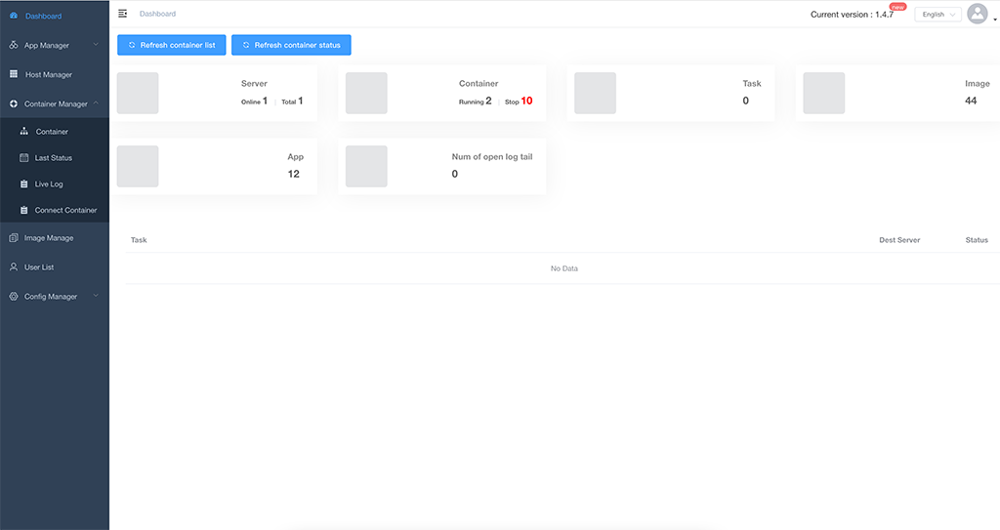
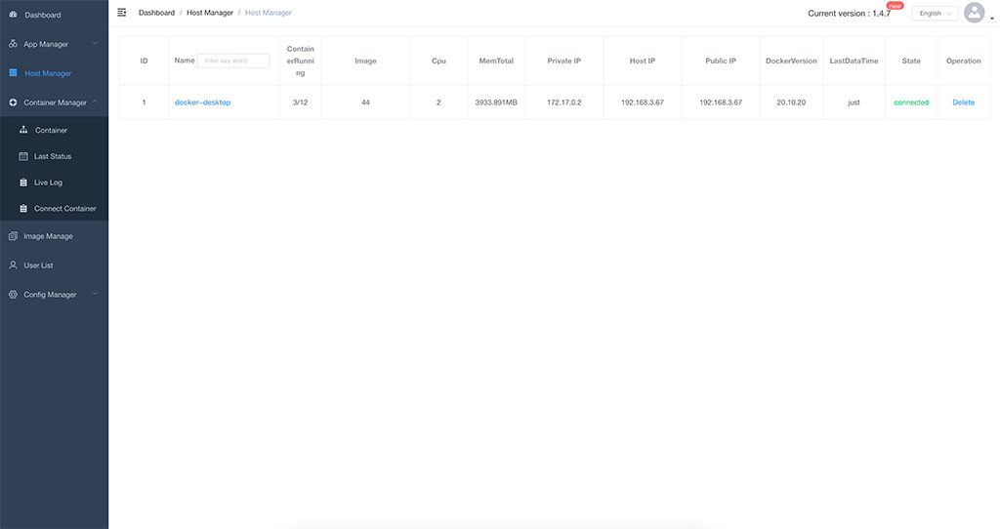
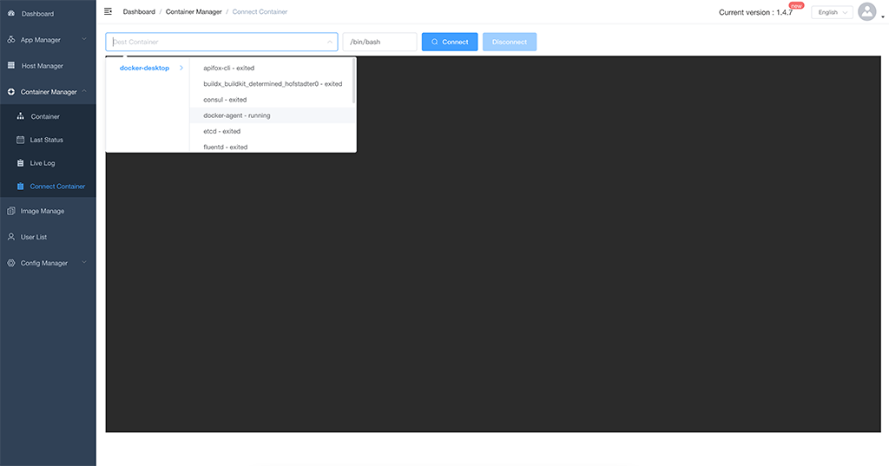
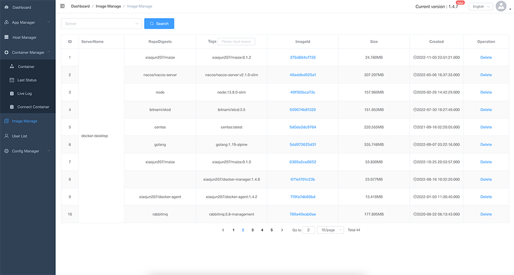
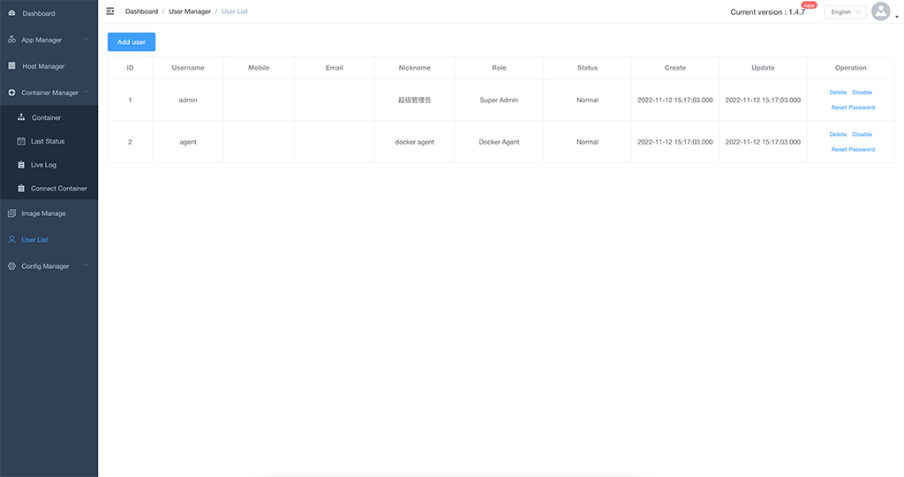

[中文说明](./docs/zh-cn/) | 
<a name="en">English</a>

## Architecture diagram


## Related projects
Front end page: https://github.com/xiaojun207/docker-manager-page
Docker-agent: https://github.com/xiaojun207/docker-agent


## UI










## Foreword
>Because some of our servers are distributed in different network environments. And, these server programs use docker for publishing, but do not use k8s such tools. In a discrete management state.
I've also considered tools like rancher, but it's still too heavy for us. I need a lighter management tool. Therefore, docker manager and docker agent were born.

## Function description
>Docker based multi host container web management, data is stored as sqlit3 by default.

* Overview, including: number of servers, number of running containers, total number of containers, number of applications, number of distributed tasks, and number of real-time logs opened.
* Display of all containers, including container name, ID, server, image used, port and creation time.
* You can start container, delete container, restart container.
* Container status information, including CPU usage, memory usage, and network usage.
* Publish a new container to the target server.
* The container real-time log (if exists) is like to: docker logs - F -- tail 10 containername. It is more resource consuming. It is better to only view the log temporarily (this function does not support cluster deployment).
* Display of server assets, mainly including: total number of containers, number of running containers, CPU usage, memory usage, docker version, and whether docker agent is online (this function does not support cluster deployment).
* User management, administrator and docker agent account, password and status management.
* White space ip list.

## Start

```shell
docker pull xiaojun207/docker-manager:latest

docker ps -aq --filter "name=docker-manager" | grep -q . && docker stop docker-manager && docker rm -fv docker-manager

docker run -d --name docker-manager -p 8068:8068 -v /app/docker-manager/data:/app/data xiaojun207/docker-manager:latest

```

or
```shell
docker run -d --name docker-manager -p 8068:8068 -e driveName=mysql -e dataSourceUrl='root:password@(dbhost:3306)/dbname?charset=utf8' xiaojun207/docker-manager:latest

```


Parameter Description:

| Parameter     | required | default value         | description                                                                                                                                                                                                                                                     |
|---------------|----------|-----------------------|-----------------------------------------------------------------------------------------------------------------------------------------------------------------------------------------------------------------------------------------------------------------|
| driveName     | no       | sqlite3               | The default is "sqlite3", or "mysql". If MySQL is used, the "datasourceurl" must be configured.                                                                                                                                                                 |
| dataSourceUrl | no       | /app/data/database.db | Database connection URL, <br>when driveName is "sqlite3"，"dataSourceUrl" default：data/database.db（/app/data/database.db），<br>when driveName is "mysql"，the "dataSourceUrl" is required，such as：-e dataSourceUrl='root:password@(dbhost:3306)/dbname?charset=utf8' |
| useCache      | no       | false                 | Whether to enable local cache. It can be enabled in stand-alone deployment, but not in cluster deployment                                                                                                                                                       |
| consoleCode   | no       | false                 | Whether to enable the console verification code. When the administrator retrieves the password, please set consolecode = true                                                                                                                                   |

or use `docker exec -it ...` go into container，use config file(/app/config.yml).

Parameter priority: 
```
 [HardCode] < [ConfigFile(./config.yml)] < [Cmd parameters (or docker -e)]
```

## Login account
Upon initial startup, the program will automatically create an administrator account (admin), a client account (agent, password), and a user name and password, which will be printed into the log output. (only displayed once, please make a backup)

## Database storage (optional)
- The data is stored as embedded sqlit3 by default, that is, docker-manager startup can be independent of other components, or mysql.
- After configuring the database connection parameters, the database tables will be automatically created and updated.
- Configuration parameters: driveName, dataSourceUrl

### sqlite3 (default)
Configure mysql as follows
```shell
-e driveName=sqlit3 -e dataSourceUrl='/app/data/database.db'  
```
### mysql
Configure mysql as follows
```shell
-e driveName=mysql -e dataSourceUrl='root:password@(dbhost:3306)/dbname? charset=utf8'  
```
Currently, both MySQL 5.6.44 and MySQL 8.0 are running normally

## Nginx proxy
eg.:
```nginx


    real_ip_header X-Forwarded-For;
    real_ip_recursive on;

    map $http_upgrade $connection_upgrade {
       default upgrade;
       ''      close;
    }

    map $http_x_forwarded_for $ClientRealIP {
            ""  $remote_addr;
            ~^(?P<firstAddr>[0-9\.]+),?.*$  $firstAddr;
    }
    
server {
   listen 80;
   server_name dockermanager.com;

   client_max_body_size 1000m;
   location / {
      proxy_set_header Host $host;
      proxy_set_header X-Real-IP $ClientRealIP;
      proxy_set_header X-Forwarded-For  $http_x_forwarded_for;
      proxy_http_version 1.1;
      proxy_set_header Upgrade $http_upgrade; # websocket
      proxy_set_header Connection $connection_upgrade; # websocket
      proxy_pass http://dockermgr_api;
   }
}
```

## Client Agent (docker-agent)
```shell
docker pull xiaojun207/docker-agent:latest

docker run -d --name docker-agent -v /var/run/docker.sock:/var/run/docker.sock -e DockerServer="http://192.168.1.200:8068/dockerMgrApi/agent" -e Username="agent" -e Password="12345678" -e HostIp="192.168.1.6" xiaojun207/docker-agent:latest

```
It should be used in conjunction with "xiaojun207/docker-agent" image. Please refer to the description for the specific usage of docker agent

Special note:
    The hostname of each server (the host of docker agent) must be unique

## Contact email
If you have any ideas or suggestions, please send an email to the following email:

email: xiaojun207@126.com

## [Thanks for JetBrains' support](https://jb.gg/OpenSourceSupport)
[](https://jb.gg/OpenSourceSupport)

