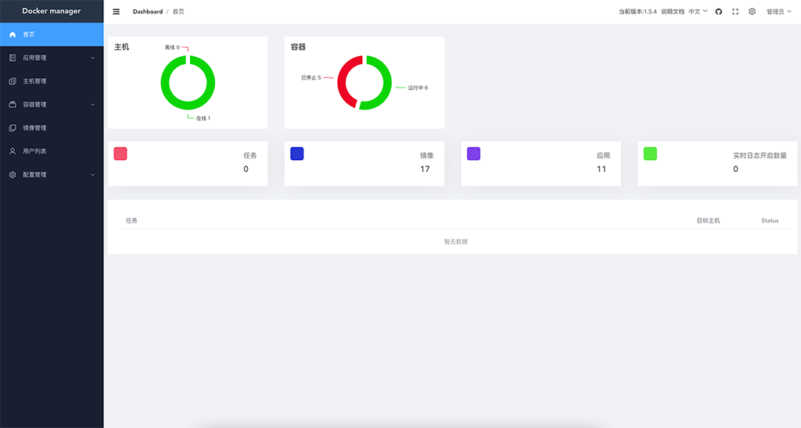
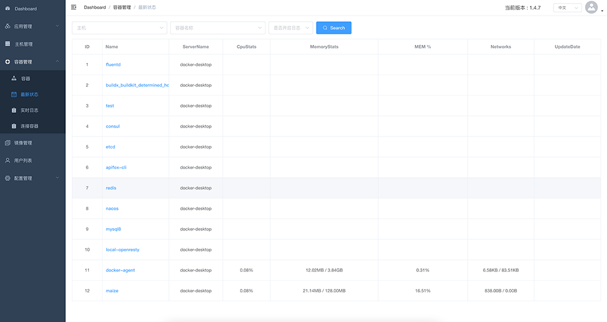
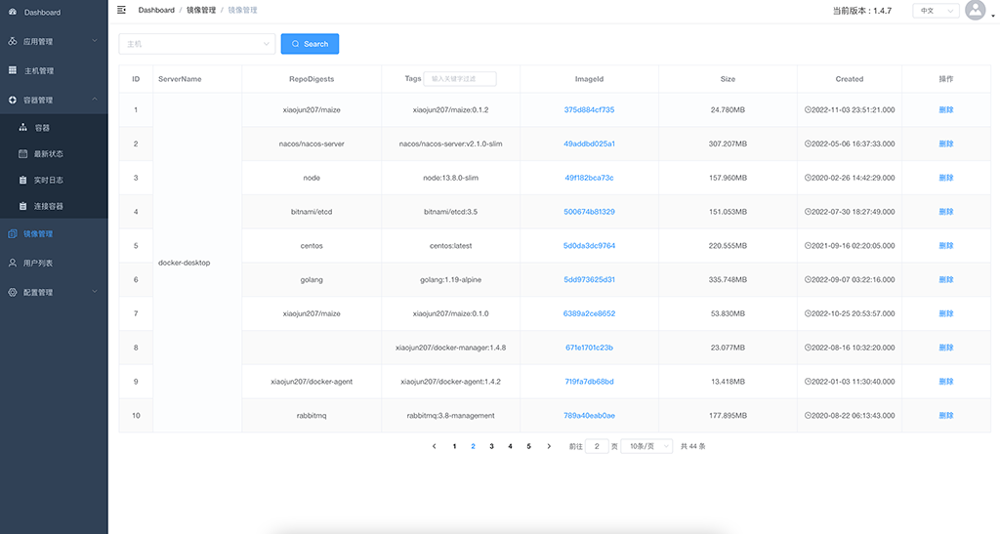
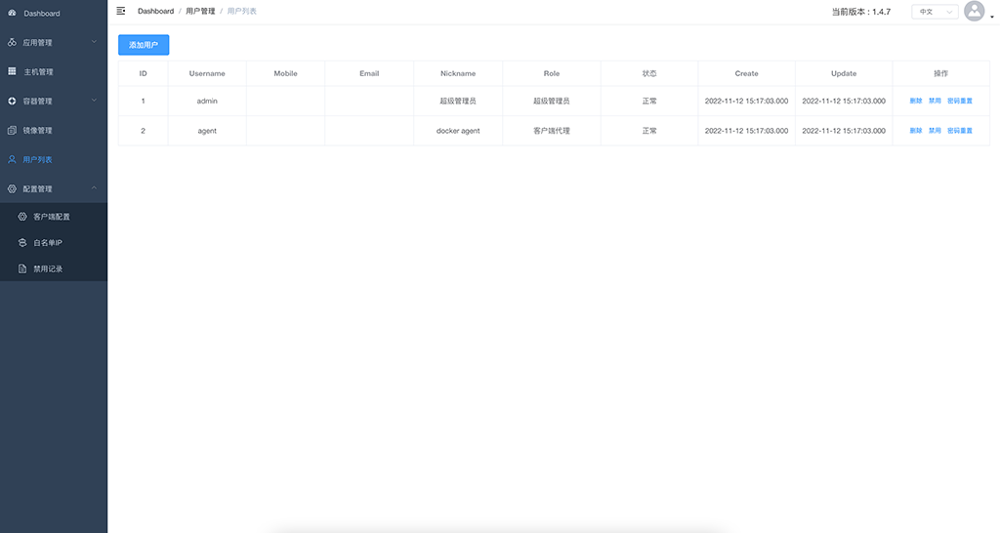

## 前言
>由于我们的一部分服务器，分布在不同的公共网络环境。而且，这些服务器程序，发布都使用了docker，但并没有使用k8s这样的工具。处于离散的管理状态。
也考虑过rancher这样的工具，但对于我们来说还是太重了。我需要一个更轻量的管理工具。因此docker-manager和docker-agent就诞生了。

## 结构图


## 功能简述
>基于docker的多主机容器web管理，数据默认存储为sqlit3，也就是说，docker-manger启动可以不依赖其他组件。

* 总览，包括：服务器数量、运行容器数量、容器总数量、应用数量、下发任务数量、实时日志开启数量
* 所有容器展示，包括：容器名称，id、所在服务器、使用镜像、端口、创建时间
* 启动容器、删除容器、重新启动
* 容器状态信息，包括：cpu使用、内存使用、网络使用
* 发布新的容器到目标服务器
* 容器实时日志（如果有的话），相当于docker logs -f --tail 10 容器名，比较耗资源，仅临时查看日志用比较好（该功能不支持集群部署）
* 服务器资产展示，主要包括：容器总数量、运行容器数量、cpu使用、内存使用、docker版本、docker-agent是否在线（该功能不支持集群部署）
* 用户管理，对管理员和docker-agent账号、密码、状态管理
* 访问白名单IP设置

## 部分界面









## 快速启动

```shell
docker pull xiaojun207/docker-manager:latest

docker ps -aq --filter "name=docker-manager" | grep -q . && docker stop docker-manager && docker rm -fv docker-manager

docker run -d --name docker-manager -p 8068:8068 -v /app/docker-manager/data:/app/data xiaojun207/docker-manager:latest

```
或者
```shell
docker run -d --name docker-manager -p 8068:8068 -e driveName=mysql -e dataSourceUrl='root:password@(dbhost:3306)/dbname?charset=utf8' xiaojun207/docker-manager:latest
```


参数说明:

| 参数            | 是否必填 | 默认值                   | 说明                                                                                                                                                                                                    |
|---------------|------|-----------------------|-------------------------------------------------------------------------------------------------------------------------------------------------------------------------------------------------------|
| driveName     | 否    | sqlite3               | 也可以是mysql，如果是mysql，则dataSourceUrl必须配置                                                                                                                                                                 |
| dataSourceUrl | 否    | /app/data/database.db | 数据库连接url<br>，当driveName为sqlite3时，dataSourceUrl默认为：data/database.db（即/app/data/database.db），<br>当driveName为mysql时，dataSourceUrl则必填，例如：-e dataSourceUrl='root:password@(dbhost:3306)/dbname?charset=utf8' |
| useCache      | 否    | false                 | 是否启用本地缓存，单机部署的时候启用，集群部署请不要启用                                                                                                                                                                          |
| consoleCode   | 否    | false                 | 是否启用控制台验证码，管理员找回密码时，请设置consoleCode=true                                                                                                                                                               |

也可以进入到容器内部，利用配置文件/app/config.yml。

配置参数优先级：
```
 [代码] < [配置文件(./config.yml)] < [命令行参数 (或 docker -e)]
```

## 登录账号
初次启动，程序会自动创建管理员账号(admin)、客户端账号(agent)，用户名密码，会打印到日志输出中。（仅显示一次，请做好备份）
- admin
- agent

## 数据存储(可选)
- 数据默认存储为内嵌sqlit3，也就是说，docker-manger启动可以不依赖其他组件，也可以是mysql。
- 配置好数据库连接参数，数据库表会自动创建和更新。
- 配置参数： driveName、dataSourceUrl

### sqlite3 ( 默认 )
配置sqlite3的如下
```shell
 -e driveName=sqlit3 -e dataSourceUrl='/app/data/database.db'  
```

### mysql
配置mysql的如下
```shell
 -e driveName=mysql -e dataSourceUrl='root:password@(dbhost:3306)/dbname?charset=utf8'  
```

目前来说，在mysql5.6.44和mysql8.0两个版本上都运行正常

## Nginx代理设置
>需特别注意websocket相关内容

eg.:
```nginx


    real_ip_header X-Forwarded-For;
    real_ip_recursive on;

    map $http_upgrade $connection_upgrade {
       default upgrade;
       ''      close;
    }

    map $http_x_forwarded_for $ClientRealIP {
            ""  $remote_addr;
            ~^(?P<firstAddr>[0-9\.]+),?.*$  $firstAddr;
    }
    
server {
   listen 80;
   server_name dockermanager.com;

   client_max_body_size 1000m;
   location / {
      proxy_set_header Host $host;
      proxy_set_header X-Real-IP $ClientRealIP;
      proxy_set_header X-Forwarded-For  $http_x_forwarded_for;
      proxy_http_version 1.1;
      proxy_set_header Upgrade $http_upgrade;  # websocket相关内容
      proxy_set_header Connection $connection_upgrade;  # websocket相关内容
      proxy_pass http://dockermgr_api;
   }
}
```

## 客户端(docker-agent)
```shell
docker pull xiaojun207/docker-agent:latest

docker run -d --name docker-agent -v /var/run/docker.sock:/var/run/docker.sock -e DockerServer="http://192.168.1.200:8068/dockerMgrApi/agent" -e Username="agent" -e Password="12345678" -e HostIp="192.168.1.6" xiaojun207/docker-agent:latest

```
需配合xiaojun207/docker-agent镜像使用，docker-agent的具体使用方法，请参见其[docker-agent使用说明](https://github.com/xiaojun207/docker-agent)

特别说明:
每台服务器(docker-agent的宿主机)的hostname，必须唯一

## 联系邮箱
如果，你有什么想法或建议，请你发送邮件到下面的邮箱：

email: xiaojun207@126.com

## [感谢JetBrains的支持](https://jb.gg/OpenSourceSupport)
[](https://jb.gg/OpenSourceSupport)

